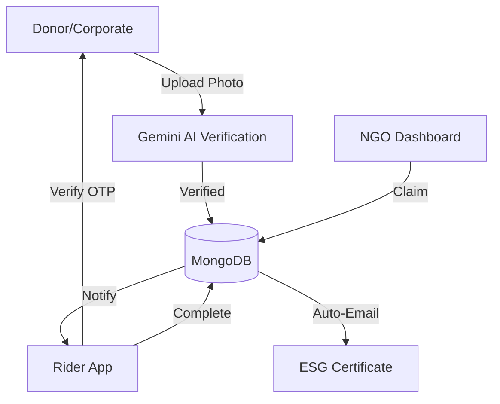

# ResQ-AI: Smart Food Rescue Ecosystem 🍎🚛

ResQ-AI is a full-stack, AI-powered platform designed to eliminate food waste by bridging the gap between donors (corporates, restaurants, individuals) and those in need (NGOs), facilitated by a dedicated network of volunteer riders.


## 🌟 Overview

Every year, tons of perfectly edible food are wasted while millions go hungry. **ResQ-AI** uses Google Gemini AI to verify food quality in real-time and automates the logistics of food rescue, providing donors with verifiable ESG (Environmental, Social, and Governance) impact reports.

## 🚀 Features

### 🧠 AI-Powered Verification
- **Gemini 1.5 Flash Integration**: Real-time analysis of food images to verify freshness, safety, and estimated shelf-life.
- **Automated Rejection**: Prevents unsafe food from entering the rescue pipeline.
- **Smart Prioritization**: Dynamically ranks donations based on perishability and urgency.

### 🍱 Multi-Role Dashboards
- **Corporate/Donor**: Easy listing with AI verification, donation history, and ESG impact tracking.
- **NGO**: Match demand with available local donations and claim listings.
- **Rider**: Interactive swipe-to-accept interface, live Google Maps navigation, and secure OTP verification.
- **Admin**: Comprehensive analytics, user management, and prioritization controls.

### 🏆 ESG Impact & Recognition
- **ESG Certificates**: Automated, professional digital certificates sent to donors upon successful delivery.
- **Impact Metrics**: Track total meals rescued and CO₂ emissions prevented (2.5kg per meal).

### 📍 Logistics & Security
- **Secure OTP Flow**: 4-digit PIN verification between donor and rider ensures safe handover.
- **Real-Time Routing**: Optimized delivery paths using Geoapify integration.
- **Automated Notifications**: Nodemailer-powered alerts for claims, assignments, and completions.

## 🛠️ Tech Stack

- **Frontend**: React.js, Tailwind CSS, Framer Motion (for smooth animations).
- **Backend**: Node.js, Express.js, MongoDB (Mongoose).
- **Mobile**: Flutter (Dart).
- **AI**: Google Gemini Pro Vision / 1.5 Flash.
- **Maps/Routing**: Geoapify API, Google Maps API.
- **Mailing**: Nodemailer (SMTP).

## 🏗️ Architecture



## 🏁 Getting Started

### Prerequisites
- Node.js (v16+)
- MongoDB (Local or Atlas)
- Gemini API Key
- Geoapify API Key

### Installation

1. **Clone the repository**
   ```bash
   git clone https://github.com/Sumukha1503/FoodRescue.git
   cd FoodRescue
   ```

2. **Backend Setup**
   ```bash
   cd backend
   npm install
   # Create a .env file with:
   # MONGO_URI, JWT_SECRET, GEMINI_API_KEY, EMAIL_USER, EMAIL_PASS, GEOAPIFY_API_KEY
   npm run dev
   ```

3. **Frontend Setup**
   ```bash
   cd frontend
   npm install
   npm run dev
   ```

4. **Mobile Setup (Optional)**
   ```bash
   cd mobile_flutter
   flutter pub get
   flutter run
   ```

## 📊 Impact Calculation
- **1 Meal Rescued** = ~0.5kg of food.
- **CO₂ Offset** = 2.5kg CO₂e per 1kg of food waste prevented.
- Formula: `Meals * 0.5 * 2.5` = Total CO₂ Prevented.

---
Developed Techtonics team.
# RESQ-AI
